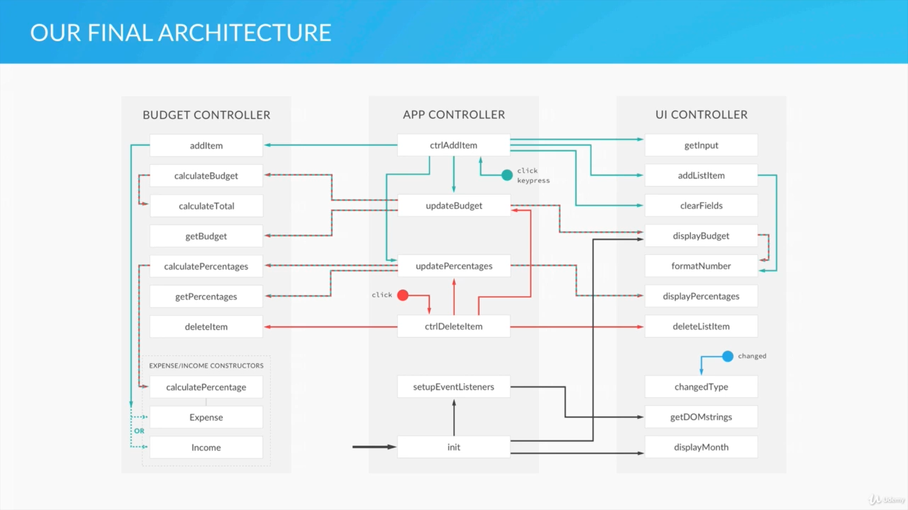

# budgety
Book Keeper

This is an online-class project, JavaScript Complete Course 2019 by Jonas Schmedtmann.

As shown on the diagram, objects were made in 3 different controllers depending on its functionality.
  - UI Controller :  What's shown on the Web browser
  - Budget Controller: calculation (addition, subtraction, percentages of expenses etc
  - AppController : This controller calls Budget and UI controllers to control the whole app.
  
  
